---

## About Me

> **Founder & CEO of [Evntd](https://github.com/evntd)** — a software consultancy laser-focused on **Event Modeling** and **Event Sourcing** to build better software for my clients.
>
> Based in Hillsboro, OR.

- 🏗️ I architect event-driven systems in **C#/.NET**, **Elixir**, and **TypeScript**
- 🔥 I created **[Fact](https://github.com/evntd/Fact)** — a file-system-based event sourcing database engine for Elixir
- 💡 Every system is a sequence of events. Model them right, and the code writes itself.

---

## Tech Stack

---

## GitHub Stats

---

## Featured Projects

| Project | Description | Tech |
|---------|-------------|------|
| [**Fact**](https://github.com/evntd/Fact) | File-system-based event sourcing database engine |   |
| [**BoardGamer.BoardGameGeek**](https://github.com/cobster/BoardGamer.BoardGameGeek) | .NET client library for BGG XML API2 |   |

---

## Activity

---

**Every system is a sequence of events. Model them right, and the code writes itself.**

